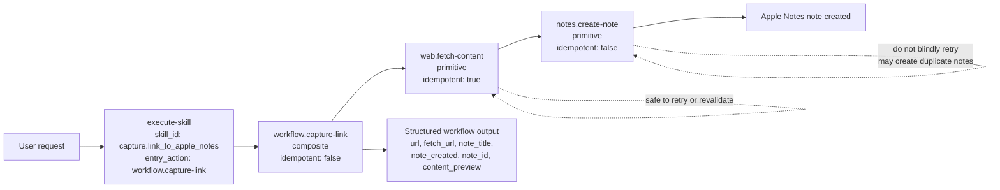

# skill-action

[中文说明](./README.zh-CN.md)

## What You Can Do With It

With `skill-action`, you can:

- describe a reusable capability as a small package
- validate inputs before execution
- run one named Action or a Skill's public entry Action
- compose small Actions into larger workflows with explicit step wiring

The main idea is simple: instead of hiding behavior inside prompts or framework internals, put it into files the runtime can validate and execute directly.

## Smallest Action/Skill Example

A Skill is a folder with a `skill.json` file plus one or more `actions/*/action.json` files.

Smallest working shape:

```json
{
  "skill_id": "sample.skill",
  "title": "Sample Skill",
  "entry_action": "workflow.increment"
}
```

```json
{
  "action_id": "workflow.increment",
  "kind": "composite",
  "idempotent": true,
  "steps": [
    {
      "id": "addOne",
      "action": "math.add-one",
      "with": {
        "value": "$input.value"
      }
    }
  ],
  "returns": {
    "value": "$steps.addOne.output.value"
  }
}
```

```json
{
  "action_id": "math.add-one",
  "kind": "primitive",
  "idempotent": true
}
```

That is enough to express a tiny Skill whose public workflow increments a number by one.

## Why This Is Not An Agent Framework

This project is best understood as an execution layer, not as an agent framework.

| `skill-action`                          | Agent framework                                       |
| --------------------------------------- | ----------------------------------------------------- |
| Runs explicit Action and Skill packages | Decides what to do next at runtime                    |
| Uses declared schemas and step wiring   | Often relies on planners, prompts, or framework state |
| Gives you predictable reusable units    | Gives you open-ended orchestration                    |
| Fits well under agents                  | Usually tries to be the agent runtime itself          |

You can build agents on top of this project, but this project itself focuses on making execution predictable and inspectable.

## Quick Start

If you want the shortest path from install to skill creation:

1. Install the CLI runtime:

```bash
npm i -g @rien7/skill-action-runtime-cli
```

2. Install the bundled skills:

```bash
npx skills add rien7/skill-action
```

3. In your agents environment, use `action-skill-creator` to create a new skill package.

## Getting Started

### 1. Read the RFC summary

Read the three RFCs in this order:

1. [Action Specification](./rfc/Action%20Specification.md)
2. [Action Runtime Protocol](./rfc/Action%20Runtime%20Protocol.md)
3. [Skill Package Specification](./rfc/Skill%20Package%20Specification.md)

If you only read one section from each:

- from the Action RFC: action kinds, bindings, conditions, composite `returns`
- from the Protocol RFC: request/response model, error model, deterministic execution
- from the Skill Package RFC: package layout, `entry_action`, `exposed_actions`, local resolution rules

### 2. Install the runtime and CLI

Install the published packages:

```bash
pnpm add @rien7/skill-action-runtime
pnpm add -g @rien7/skill-action-runtime-cli
```

For local development inside this repo, install and build per package:

```bash
cd runtime
pnpm install
pnpm check
```

```bash
cd runtime-cli
pnpm install
pnpm check
```

### 3. Run the checked-in sample Skill package

This repository includes a sample package at [`runtime-cli/test/fixtures/sample-skill`](./runtime-cli/test/fixtures/sample-skill).

Validate it:

```bash
cd runtime-cli
skill-action-runtime validate-skill-package --skill-package ./test/fixtures/sample-skill
```

Execute its public entry flow:

```bash
cd runtime-cli
echo '{"skill_id":"sample.skill","input":{"value":4}}' \
  | skill-action-runtime execute-skill \
      --skill-package ./test/fixtures/sample-skill \
      --handler-module ./test/fixtures/handlers.mjs
```

What this sample demonstrates:

- `sample.skill` exposes `workflow.increment` as its entry action
- `workflow.increment` is a composite Action
- it calls the internal primitive Action `math.add-one`
- primitive execution is provided through the handler module

### 4. Read the minimal complete example

If you want to see an end-to-end workflow instead of only a synthetic fixture, read:

- [`example/01-create-the-skill.md`](./example/01-create-the-skill.md)
- [`example/02-use-the-skill.md`](./example/02-use-the-skill.md)

The example package used in those two walkthroughs is [`example/skills/capture-link-to-apple-notes`](./example/skills/capture-link-to-apple-notes).

Run it from the repository root:

```bash
skill-action-runtime validate-skill-package \
  --skill-package ./example/skills/capture-link-to-apple-notes \
  --output json
```

```bash
skill-action-runtime execute-skill \
  --skill-package ./example/skills/capture-link-to-apple-notes \
  --skill-id capture.link_to_apple_notes \
  --handler-module ./example/skills/capture-link-to-apple-notes/handlers.mjs \
  --trace-level none \
  --input-json '{"url":"https://www.example.com","dry_run":true}' \
  --output json
```

### 5. Execution Flow And Idempotency



In this example:

- `web.fetch-content` is idempotent because repeating the fetch does not create a duplicate external record
- `notes.create-note` is not idempotent because repeating it can create multiple notes
- `workflow.capture-link` is not idempotent because it includes the non-idempotent note-creation step

That difference is why the package also supports an input-level `dry_run` mode:

- you can prove the workflow wiring safely
- you can exercise the fetch step without creating a real note
- you do not have to treat every validation run as a side-effecting write

## What Is In This Repository

### `rfc/`

The normative specification layer of the project.

- [`rfc/Action Specification.md`](./rfc/Action%20Specification.md): Action model, bindings, conditions, composite execution, `returns`
- [`rfc/Action Runtime Protocol.md`](./rfc/Action%20Runtime%20Protocol.md): transport, request/response shapes, error model, execution semantics
- [`rfc/Skill Package Specification.md`](./rfc/Skill%20Package%20Specification.md): package layout, `skill.json`, `actions/actions.json`, entry action, exposure rules

### `runtime/`

The TypeScript runtime implementation published as [`@rien7/skill-action-runtime`](./runtime/README.md).

It implements the core protocol operations:

- `resolveAction`
- `validateActionInput`
- `executeAction`
- `executeSkill`

### `runtime-cli/`

The command-line runtime published as [`@rien7/skill-action-runtime-cli`](./runtime-cli/README.md).

It exposes the RFC model through a CLI transport for:

- discovery
- validation
- resolution
- execution

### `skills/`

Skill packages and authoring helpers that use the same package model defined in the RFCs.

Current examples in this repo are focused on authoring and running action-based skills:

- `skills/action-creator`
- `skills/action-runner`
- `skills/action-skill-creator`

### `example/`

A public, inspectable example that shows the full lifecycle:

- starting from a natural-language request
- generating a runnable skill package
- validating it through the runtime CLI
- using that generated skill in a later request

Read it in two steps:

- [`example/01-create-the-skill.md`](./example/01-create-the-skill.md)
- [`example/02-use-the-skill.md`](./example/02-use-the-skill.md)

## Reading Path By Role

- Spec reader: start in `rfc/`
- Runtime integrator: read `rfc/` first, then [`runtime/README.md`](./runtime/README.md)
- CLI user: read `rfc/Action Runtime Protocol.md` first, then [`runtime-cli/README.md`](./runtime-cli/README.md)
- Skill author: read the Skill Package RFC first, then inspect `skills/`

## Repository Principle

The RFCs are the product surface.

The runtime, CLI, and skill packages exist to implement and exercise that surface, not to replace it.
