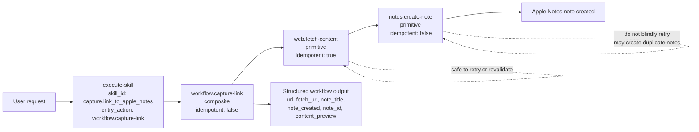

# skill-action

[中文说明](./README.zh-CN.md)

## What You Can Do With It

With `skill-action`, you can:

- describe a reusable capability as a small package
- validate inputs before execution
- run one named action or a skill's public entry action
- combine small actions into larger workflows with clear data flow between steps

The central idea is simple: instead of leaving behavior inside prompts or framework internals, describe it in files that the runtime can validate and execute directly.
This repository defines that file format and provides the runtime that executes it.

## Quick Start

1. Install the CLI runtime:

```bash
npm i -g @rien7/skill-action-runtime-cli
```

2. Install the bundled skills:

```bash
npx skills add rien7/skill-action
```

3. In your agent environment, use `action-skill-creator` to create a new skill package.

## Smallest Action/Skill Example

In this repository, a skill is a folder containing a `skill.json` file and one or more `actions/*/action.json` files.

Minimal layout:

```txt
sample-skill/
  skill.json
  actions/
    workflow-increment/
      action.json
    math-add-one/
      action.json
```

Minimal working shape:

```json
{
  "skill_id": "sample.skill",
  "title": "Sample Skill",
  "entry_action": "workflow.increment"
}
```

```json
{
  "action_id": "workflow.increment",
  "kind": "composite",
  "idempotent": true,
  "steps": [
    {
      "id": "addOne",
      "action": "math.add-one",
      "with": {
        "value": "$input.value"
      }
    }
  ],
  "returns": {
    "value": "$steps.addOne.output.value"
  }
}
```

```json
{
  "action_id": "math.add-one",
  "kind": "primitive",
  "idempotent": true
}
```

This is sufficient to describe a small skill whose public workflow increments a number by one.

## Compared With Agent Runtimes

`skill-action` is an execution layer rather than a full agent runtime.

| `skill-action`                                            | Agent runtime                                              |
| --------------------------------------------------------- | ---------------------------------------------------------- |
| Runs named actions and skill packages                     | Decides what to do next at runtime                         |
| Uses declared inputs, outputs, and step-to-step data flow | Often relies on planners, prompts, or hidden runtime state |
| Gives you predictable reusable execution units            | Gives you open-ended orchestration                         |
| Fits well under agents                                    | Usually tries to be the full agent system                  |

You can build agents on top of this project, but its purpose is narrower: to make behavior easier to validate, execute, and reuse.

## Getting Started

### 1. Read the specifications if you want the full model

Read the three RFCs in this order:

1. [Action Specification](./rfc/Action%20Specification.md)
2. [Action Runtime Protocol](./rfc/Action%20Runtime%20Protocol.md)
3. [Skill Package Specification](./rfc/Skill%20Package%20Specification.md)

If you only need the main sections:

- from the Action RFC: action kinds, bindings, conditions, composite `returns`
- from the Protocol RFC: request/response structure, errors, repeatable execution
- from the Skill Package RFC: folder layout, `entry_action`, exposed actions, local lookup rules

### 2. Install the runtime and CLI

Install the published packages:

```bash
pnpm add @rien7/skill-action-runtime
pnpm add -g @rien7/skill-action-runtime-cli
```

For local development inside this repo, install and build per package:

```bash
cd runtime
pnpm install
pnpm check
```

```bash
cd runtime-cli
pnpm install
pnpm check
```

### 3. Run the checked-in sample Skill package

This repository includes a sample package at [`runtime-cli/test/fixtures/sample-skill`](./runtime-cli/test/fixtures/sample-skill).

Validate it:

```bash
cd runtime-cli
skill-action-runtime validate-skill-package --skill-package ./test/fixtures/sample-skill
```

Execute its public entry flow:

```bash
cd runtime-cli
echo '{"skill_id":"sample.skill","input":{"value":4}}' \
  | skill-action-runtime execute-skill \
      --skill-package ./test/fixtures/sample-skill \
      --handler-module ./test/fixtures/handlers.mjs
```

What this sample demonstrates:

- `sample.skill` exposes `workflow.increment` as its entry action
- `workflow.increment` is a composite Action
- it calls the internal primitive Action `math.add-one`
- primitive execution is provided through the handler module

### 4. Read the minimal complete example

If you want to see an end-to-end workflow based on a real example in this repo, read:

- [`example/01-create-the-skill.md`](./example/01-create-the-skill.md)
- [`example/02-use-the-skill.md`](./example/02-use-the-skill.md)

The example package used in those two walkthroughs is [`example/skills/capture-link-to-apple-notes`](./example/skills/capture-link-to-apple-notes).

Run it from the repository root:

```bash
skill-action-runtime validate-skill-package \
  --skill-package ./example/skills/capture-link-to-apple-notes \
  --output json
```

```bash
skill-action-runtime execute-skill \
  --skill-package ./example/skills/capture-link-to-apple-notes \
  --skill-id capture.link_to_apple_notes \
  --handler-module ./example/skills/capture-link-to-apple-notes/handlers.mjs \
  --trace-level none \
  --input-json '{"url":"https://www.example.com","dry_run":true}' \
  --output json
```

### 5. Execution Flow And Safe Re-runs



Key points:

- `web.fetch-content` is safe to re-run because repeating the fetch does not create a duplicate external record
- `notes.create-note` is not safe to blindly re-run because repeating it can create multiple notes
- `workflow.capture-link` is also not safe to blindly re-run because it includes the note-creation step

That is why the package also supports an input-level `dry_run` mode:

- you can prove the workflow safely
- you can exercise the fetch step without creating a real note
- you do not have to treat every validation run as a side-effecting write

## What Is In This Repository

### `rfc/`

The specifications for actions, skills, and execution.

- [`rfc/Action Specification.md`](./rfc/Action%20Specification.md): the action model and composite execution
- [`rfc/Action Runtime Protocol.md`](./rfc/Action%20Runtime%20Protocol.md): request, response, and error structure
- [`rfc/Skill Package Specification.md`](./rfc/Skill%20Package%20Specification.md): skill package layout and public entry points

### `runtime/`

The TypeScript runtime published as [`@rien7/skill-action-runtime`](./runtime/README.md).

It provides the core operations:

- `resolveAction`
- `validateActionInput`
- `executeAction`
- `executeSkill`

### `runtime-cli/`

The command-line runtime published as [`@rien7/skill-action-runtime-cli`](./runtime-cli/README.md).

It exposes the same model through the command line for:

- discovery
- validation
- resolution
- execution

### `skills/`

Reusable skill packages and authoring helpers.

The current examples in this repository focus on creating and running skills:

- `skills/action-creator`
- `skills/action-runner`
- `skills/action-skill-creator`

### `example/`

A public example that shows the full lifecycle:

- starting from a natural-language request
- generating a runnable skill
- validating it through the runtime CLI
- using that generated skill in a later request

Read it in two steps:

- [`example/01-create-the-skill.md`](./example/01-create-the-skill.md)
- [`example/02-use-the-skill.md`](./example/02-use-the-skill.md)

### Reading Path By Role

- If you want to run something quickly: start with `Quick Start`
- If you want the full worked example: read `example/`
- If you want the implementation details: read `runtime/` and `runtime-cli/`
- If you want to write skills: inspect `skills/` and then read the RFCs as needed
