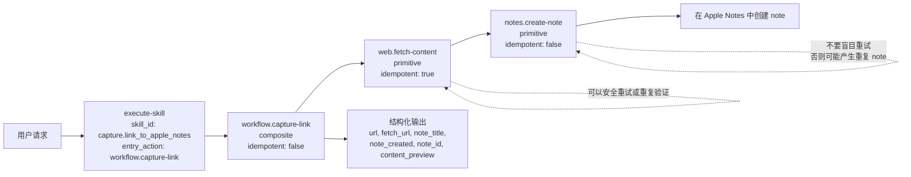

# skill-action

[English](./README.md)

## 你可以用它做什么

用 `skill-action`，你可以：

- 把一个可复用能力写成一个小 package
- 在执行前先校验输入
- 运行某个指定 Action，或者运行整个 Skill 的公开入口 Action
- 把小 Action 组合成更大的 workflow，并且显式写出步骤之间怎么传值

核心思路很直接：不要把行为藏在 prompt 或框架内部，而是把它写进运行时可以直接校验和执行的文件里。

## 最小 Action/Skill 例子

一个 Skill 本质上就是一个目录，里面至少有一个 `skill.json`，以及一个或多个 `actions/*/action.json`。

最小可工作的形态可以长这样：

```json
{
  "skill_id": "sample.skill",
  "title": "Sample Skill",
  "entry_action": "workflow.increment"
}
```

```json
{
  "action_id": "workflow.increment",
  "kind": "composite",
  "idempotent": true,
  "steps": [
    {
      "id": "addOne",
      "action": "math.add-one",
      "with": {
        "value": "$input.value"
      }
    }
  ],
  "returns": {
    "value": "$steps.addOne.output.value"
  }
}
```

```json
{
  "action_id": "math.add-one",
  "kind": "primitive",
  "idempotent": true
}
```

这就足够表达一个最小 Skill：它的公开 workflow 会把输入数字加一后返回。

## 为什么这不是 agent framework

更准确地说，这个项目是执行层，不是 agent framework。

| `skill-action`                           | agent framework                         |
| ---------------------------------------- | --------------------------------------- |
| 运行显式定义好的 Action 和 Skill package | 在运行时决定下一步做什么                |
| 依赖声明好的 schema 和 step wiring       | 往往依赖 planner、prompt 或框架内部状态 |
| 提供可预测、可复用的执行单元             | 提供开放式的编排能力                    |
| 很适合作为 agent 的底层能力              | 往往自己就是 agent 运行时               |

你当然可以在它上面构建 agents，但它本身更专注于把执行过程做得稳定、可检查、可复用。

## 快速开始

如果你想用最短路径从安装走到创建 skill：

1. 安装 CLI 运行时：

```bash
npm i -g @rien7/skill-action-runtime-cli
```

2. 安装这个仓库提供的 skills：

```bash
npx skills add rien7/skill-action
```

3. 在 agents 环境中使用 `action-skill-creator` 来创建新的 skill package。

## 怎么开始

### 1. 先读规范摘要

建议按这个顺序读：

1. [Action Specification](./rfc/Action%20Specification.md)
2. [Action Runtime Protocol](./rfc/Action%20Runtime%20Protocol.md)
3. [Skill Package Specification](./rfc/Skill%20Package%20Specification.md)

如果你只想快速抓住重点，可以优先看：

- Action RFC：action kind、binding、condition、composite `returns`
- Protocol RFC：request/response 模型、error model、deterministic execution
- Skill Package RFC：package layout、`entry_action`、`exposed_actions`、local resolution

### 2. 安装 runtime 和 CLI

安装已发布包：

```bash
pnpm add @rien7/skill-action-runtime
pnpm add -g @rien7/skill-action-runtime-cli
```

如果你是在这个仓库里本地开发，分别在子目录安装和构建：

```bash
cd runtime
pnpm install
pnpm check
```

```bash
cd runtime-cli
pnpm install
pnpm check
```

### 3. 跑仓库里自带的 sample Skill package

仓库里自带一个 sample package，路径在 [`runtime-cli/test/fixtures/sample-skill`](./runtime-cli/test/fixtures/sample-skill)。

先校验：

```bash
cd runtime-cli
skill-action-runtime validate-skill-package --skill-package ./test/fixtures/sample-skill
```

再执行它的公开入口：

```bash
cd runtime-cli
echo '{"skill_id":"sample.skill","input":{"value":4}}' \
  | skill-action-runtime execute-skill \
      --skill-package ./test/fixtures/sample-skill \
      --handler-module ./test/fixtures/handlers.mjs
```

这个 sample 展示了什么：

- `sample.skill` 暴露了 `workflow.increment` 作为 entry action
- `workflow.increment` 是一个 composite Action
- 它内部调用了 primitive Action `math.add-one`
- primitive 的实际执行由 handler module 提供

### 4. 看这个最小完整示例

如果你想看的不是 synthetic fixture，而是一条完整的 end-to-end workflow，可以直接读：

- [`example/01-create-the-skill.md`](./example/01-create-the-skill.md)
- [`example/02-use-the-skill.md`](./example/02-use-the-skill.md)

这两篇 walkthrough 对应的 package 在 [`example/skills/capture-link-to-apple-notes`](./example/skills/capture-link-to-apple-notes)。

下面这些命令都假设你当前在仓库根目录：

```bash
skill-action-runtime validate-skill-package \
  --skill-package ./example/skills/capture-link-to-apple-notes \
  --output json
```

```bash
skill-action-runtime execute-skill \
  --skill-package ./example/skills/capture-link-to-apple-notes \
  --skill-id capture.link_to_apple_notes \
  --handler-module ./example/skills/capture-link-to-apple-notes/handlers.mjs \
  --trace-level none \
  --input-json '{"url":"https://www.example.com","dry_run":true}' \
  --output json
```

### 5. Execution Flow 与 Idempotency



在这个示例里：

- `web.fetch-content` 是幂等的，因为重复抓取不会创建重复的外部记录
- `notes.create-note` 不是幂等的，因为重复执行可能创建多个 note
- `workflow.capture-link` 也不是幂等的，因为它内部包含了创建 note 的非幂等步骤

这也是为什么这个 package 还额外支持输入级别的 `dry_run`：

- 可以安全地验证 workflow wiring
- 可以真实跑过 fetch 这一步，但不创建 note
- 不需要把每次验证都当成一次带副作用的写操作

## 仓库里有什么

### `rfc/`

这是仓库的规范层。

- [`rfc/Action Specification.md`](./rfc/Action%20Specification.md)：定义 Action 模型、binding、condition、composite 执行、`returns`
- [`rfc/Action Runtime Protocol.md`](./rfc/Action%20Runtime%20Protocol.md)：定义 transport、请求/响应结构、错误模型、执行语义
- [`rfc/Skill Package Specification.md`](./rfc/Skill%20Package%20Specification.md)：定义 package 布局、`skill.json`、`actions/actions.json`、入口 action 和暴露规则

### `runtime/`

TypeScript 运行时实现，发布包名为 [`@rien7/skill-action-runtime`](./runtime/README.md)。

它实现了四个核心协议能力：

- `resolveAction`
- `validateActionInput`
- `executeAction`
- `executeSkill`

### `runtime-cli/`

命令行运行时，发布包名为 [`@rien7/skill-action-runtime-cli`](./runtime-cli/README.md)。

它把 RFC 里的协议模型暴露成 CLI 入口，用于：

- discovery
- validation
- resolution
- execution

### `skills/`

这里放的是基于同一套 RFC package 模型构建的 Skill 包和作者工具。

当前仓库里的例子主要围绕 action-based skill 的创建与运行：

- `skills/action-creator`
- `skills/action-runner`
- `skills/action-skill-creator`

### `example/`

这里放的是一套可以公开阅读的完整示例，展示：

- 从自然语言需求出发
- 生成一个可运行的 skill package
- 通过 runtime CLI 做验证
- 在后续请求里使用这个生成出来的 skill

建议按这两个文件阅读：

- [`example/01-create-the-skill.md`](./example/01-create-the-skill.md)
- [`example/02-use-the-skill.md`](./example/02-use-the-skill.md)

## 按角色阅读

- 只想理解模型：先看 `rfc/`
- 想嵌入运行时：先读 `rfc/`，再看 [`runtime/README.md`](./runtime/README.md)
- 想从命令行跑：先读 `rfc/Action Runtime Protocol.md`，再看 [`runtime-cli/README.md`](./runtime-cli/README.md)
- 想写 Skill package：先读 Skill Package RFC，再看 `skills/`

## 仓库原则

RFC 才是这个项目的产品表面。

runtime、CLI 和 skill packages 的作用，是实现并验证这层表面，而不是替代它。
